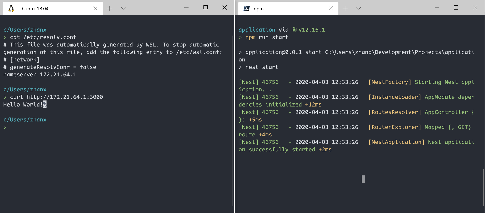

Recently, WSL 2 landed on the slow ring of Windows Preview. As a fan of WSL myself, I've been eager to try it out and enjoy the improved I/O performance it brings to the table. So without further delay, I opted in, upgraded to Win10 2004 and enabled WSL 2. HOWEVER (there is always a "however"), not all things are smoothed out yet at the time of writing. In this post, I am going to write about my experience of setting up WSL 2 for a Django web development workflow.

## Zsh

My `.zshrc`:

```shell
# enabling some built-in features
zstyle ':completion:*' menu select
autoload -U compinit && compinit

# personal aliases
alias mooc="cd /home/xzhan/Development/MOOC"
alias proj="cd /home/xzhan/Development/Projects"
alias pk="cd /home/xzhan/Development/Packages"
alias wk="cd /home/xzhan/Development/Work"
alias da="deactivate"
alias dcu="docker-compose up"
alias dcud="docker-compose up -d"
alias dex="docker-compose exec"
alias dcd="docker-compose down"
alias dcs="docker-compose stop"
alias dcl="docker-compose logs"
alias vim="nvim"
alias ls="lsd"
alias ll="lsd -l"

# added for vscode
alias code="/mnt/c/Users/zhanx/AppData/Local/Programs/'Microsoft VS Code'/bin/code"

# added for miniconda3
export PATH="/home/xzhan/miniconda3/bin:$PATH"

# added for pipenv
export PIPENV_VENV_IN_PROJECT=True
eval "$(pipenv --completion)"

# added for rust
export PATH="/home/xzhan/.cargo/bin:$PATH"

# added for homebrew
export PATH="/home/linuxbrew/.linuxbrew/bin:$PATH"

# added for nvm
export NVM_DIR="$([ -z "${XDG_CONFIG_HOME-}" ] && printf %s "${HOME}/.nvm" || printf %s "${XDG_CONFIG_HOME}/nvm")"
[ -s "$NVM_DIR/nvm.sh" ] && \. "$NVM_DIR/nvm.sh"

# added for zsh-history-substring-search
HISTFILE=~/.zsh_history
source /home/linuxbrew/.linuxbrew/share/zsh-history-substring-search/zsh-history-substring-search.zsh
bindkey "$terminfo[kcuu1]" history-substring-search-up
bindkey "$terminfo[kcud1]" history-substring-search-down

eval "$(starship init zsh)"
```

A few things to pay attention to here:

### WSL 2 I/O Performance Catch

WSL 2 has a much improved I/O performance, but only on the Linux partition. As described in [this documentation](https://docs.microsoft.com/en-us/windows/wsl/wsl2-ux-changes#cross-os-file-speed-will-be-slower-in-initial-preview-builds) WSL 2 has a much slower performance when performing cross OS I/O tasks. Outcome include:

- **Unacceptable slow performance with zsh shell prompt/plugins**, like [oh-my-zsh](https://ohmyz.sh/) or [starship](https://starship.rs/). I don't know enough about the internal implementation of these projects to identify the direct reason, but the outcome is printing a new line takes over 30s :upside_down_face::

  

- **Slow start up performance.** Sometimes the WSL prompt can take over 15s to start. One way to mitigate this is to exclude the inclusion of Windows PATH, with which I can reduce the start up time down to 1s. This will be elaborated in the next point.

If you are interested you can follow up on the progress at [this Github issue](https://github.com/microsoft/WSL/issues/4197). Note that the problem is clearly known and actively working on so hold yourself from spam the thread with +1 comments.

### Exclude Windows PATH

As mentioned, excluding Windows PATH can bring some nice performance boost. If you are not relying heavily on Windows programs anyways, you can safely exclude it by adding this to `/etc/wsl.conf`:

```toml
[Interop]
appendWindowsPath = False
```

"But what about VS Code?! :scream:" Don't worry my friend. I have you covered. Notice that we have a special alias on line 22 of the `.zshrc` file:

```shell
alias code="/mnt/c/Users/zhanx/AppData/Local/Programs/'Microsoft VS Code'/bin/code"
```

With this alias we can now use the `code` command inside WSL 2 as we would in any local shell terminal.

### Zsh History Search & Starship

With a ton of experiments, some of which can be seen in [this GitHub issue](https://github.com/starship/starship/issues/1038), my zsh with oh-my-zsh was proven to be slow in WSL 2. Slower than I would like, at least. I used to be a big fan as it really helps configure a nice and usable zsh out of the box. However, it includes too many things under the hood which I don't really need. Some of the features I would really like to keep are:

- Menu-like options when hitting Tab, which is built-in and can be enabled like shown at the beginning of my `.zshrc`
- A nice-looking theme. I really like the [spaceship theme](https://github.com/denysdovhan/spaceship-prompt)
- History search with up arrow key

After searching for a while, I landed on [starship](https://starship.rs/), a Rust-powered and spaceship-inspired cross-shell prompt which also works with Powershell (Yay!! :hugs:), and this nice [zsh-history-substring-search](https://github.com/zsh-users/zsh-history-substring-search) plugin. I installed th latter via [homebrew](https://docs.brew.sh/Homebrew-on-Linux). You can configure them just like I did at the end of the `.zshrc` file.

### Typeface & Nerd Font

As you would expect from a spaceship theme user, I like icons and emojis. However, not all emojis look nice in every terminal on every OS. On the other hand, nerd font icons are much are consistent and renders nicer in VS Code's built-in terminal. You can find [a preset config from starship](https://starship.rs/presets/).

A nice typeface is also critical to a nice CLI experience. As a diehard Consolas fan, I've always been looking around for an open source alternative that I can use across all systems. Luckily, that mission was recently accomplished: [Code New Roman](https://fontsarena.com/code-new-roman-by-sam-radian/) and its nerd font version [CodeNewRoman Nerd Font](https://www.nerdfonts.com/font-downloads). Give them a try if you share the love for Consolas!

## Python & Node

As you might have noticed, I use [miniconda](https://docs.conda.io/en/latest/miniconda.html) and [nvm](https://github.com/nvm-sh/nvm) for managing Python and node/npm versions. You can install them simply by running:

```shell
# miniconda
wget https://repo.anaconda.com/miniconda/Miniconda3-latest-Linux-x86_64.sh
sh ./Miniconda3-latest-Linux-x86_64.sh

# nvm
wget -qO- https://raw.githubusercontent.com/nvm-sh/nvm/v0.35.3/install.sh | bash
# and add the nvm-related scripts to your .zshrc
nvm install --lts
```

If you know Anaconda, miniconda is just a stripped-down version of it. I like using it because of its separation from the system Python: I don't need to worry about breaking some system packages when I upgrade my Python installation. Conda, the dependency manager miniconda uses, can also identify packages that need upgrade and resolve conflicts when you bump up the Python version. At the time of writing, miniconda only comes with Python 3.7. However, you can easily upgrade to Python 3.8 by:

```shell
conda install python=3.8
```

If you want to upgrade, please do this right after installing miniconda as I've experienced some failures with a dozen packages already installed. For my purpose, Django already support Python 3.8 since 2.2.8 so it's safe to make the upgrade.

## Web & Database

Here comes the (a bit) more tricky part. IIRC, previously in WSL 1, you can access the host (Windows) database from inside WSL. Due the the architecture change in WSL 2, you are not able to do that out of the box. Here in [this section](https://docs.microsoft.com/en-us/windows/wsl/wsl2-ux-changes#accessing-network-applications) it says:

> To access a Windows network application you'll need to use the IP address of your host machine.

You can do so by `cat /etc/resolv.conf` inside WSL, copy the IP address following "nameserver" and use it in your CLI:



Easy enough for web services. But what about database? Well, here you have two options.

### Install Database in WSL

One of the more straightforward option is to install your database server inside your WSL 2. It is just the same as installing your database on any Ubuntu-based distro. As for my project, I use MariaDB and you can find [the official instructions here](https://downloads.mariadb.org/mariadb/repositories/#distro=Ubuntu&distro_release=bionic--ubuntu_bionic&mirror=homelab&version=10.4). You will be able to start the database server with `sudo service mysql start`. The problem comes after the installation: How do I inspect the database with my favorite GUI tools like DataGrip/DBeaver/Sequel Pro from Windows?

First, if you have a database server running on you Windows host, make sure to change either one of the ports your database is running on. Then, bind your WSL 2 database to the address `0.0.0.0`. These settings can be applied by adding the following lines to your `/etc/mysql/my.cnf`:

```toml
[mysqld]
port=3307 # or any port you like
bind-address=0.0.0.0
```

After editing, make sure to restart the database server by `sudo service mysql restart`. Now you should be able to access your WSL database via `127.0.0.1:3307`.

### Accessing Database Running on Windows from WSL

**TL;DR** I personally don't recommend this approach because it requires much more workaround.

**Warning**: This approach relies on the IP addresses on both the host and guest machine pointing to each other. As [Uzume stated here](https://github.com/microsoft/WSL/issues/4619#issuecomment-592482735), WSL 2 acts more like a virtual machine compared to WSL 1. **HOWEVER, these IP addresses are NOT fixed!** They change on every reboot so you have to reconfigure something every time.



As shown in the graph above, in the current setting, WSL 2 can access Windows application via `172.21.64.1`, which is the IP address in `/etc/resolv.conf`. By default, Windows share the `127.0.0.1` with WSL 2 and can access network applications running in WSL 2 via `127.0.0.1:<port>` as shown above. You may wonder, "Well, what's the use of that `172.17.131.186` in this case and where does it come from?" :thinking:

That's a great question. Databases, out of security consideration, do not allow remote access by default. You have to manually grant remote access to specified IP addresses if you want to do so. Let's first try to connect to the MariaDB running on Windows from WSL 2 first and see what will happen:

```shell
# Inside WSL 2
mysql -u root \
  -h 172.21.64.1 \ # replace1 172.21.64.1 with your own IP address in /etc/resolv.conf
  -p windows_db # replace windows_db with your own db name
```

At this point, you will likely encounter some error message like this:

```shell
# Inside WSL 2
> mysql -u local_pr -h 172.21.64.1 -p windows_db
Enter password:
ERROR 1130 (HY000): Host '172.17.131.186' is not allowed to connect to this MariaDB server
```

Here we get `172.17.131.186`, the IP address of our WSL 2 virtual machine on Windows. Seeing this error message is actually a good sign as it indicates you can hit the database but just don't have the access right. What you need to do now is to configure your database server for remote access and grant access to your WSL 2's IP address `172.17.131.186`. For MariaDB, the instructions can be found [here](https://mariadb.com/kb/en/configuring-mariadb-for-remote-client-access/). Following the instructions, we start the MySQL client command prompt, log in and type:

```shell
# Inside MySQL Client on Windows
GRANT ALL PRIVILEGES ON windows_db.* TO 'local_pr'@'172.17.131.186' IDENTIFIED BY 'my-new-password';
# again, replace the db name, ip address and password to your local ones
```

You might need to restart the MariaDB server for it to take effect. If all goes well, you can now access the Windows MariaDB from WSL 2:

```shell
# Inside WSL 2
> mysql -u local_pr -h 172.17.128.1 -p local_pr
Enter password:
Reading table information for completion of table and column names
You can turn off this feature to get a quicker startup with -A

Welcome to the MariaDB monitor.  Commands end with ; or \g.
Your MariaDB connection id is 15
Server version: 10.4.12-MariaDB mariadb.org binary distribution

Copyright (c) 2000, 2018, Oracle, MariaDB Corporation Ab and others.

Type 'help;' or '\h' for help. Type '\c' to clear the current input statement.

MariaDB [local_pr]>
```

Now you can put the database host info in your web app's settings. For example, in Django's setting file:

```python
DATABASES = {
    'default': {
        'ENGINE': 'django.db.backends.mysql',
        'NAME': 'local_pr',
        'USER': 'local_pr',
        'PASSWORD': 'my-new-password',
        'HOST': '172.21.64.1',
        'PORT': '3306',
    },
}
```

## VS Code

Microsoft really provides great tooling for your development workflow on WSL. No surprice, my editor of choice is VS Code. For remote development using WSL, check out [this guide](https://code.visualstudio.com/docs/remote/wsl#_wsl-specific-settings) if you haven't. Not everything applies to WSL 2 just yet but it's still a nice guide. What we need most is the [Remote - WSL](https://marketplace.visualstudio.com/items?itemName=ms-vscode-remote.remote-wsl) extension. With it installed, we can now go to any working directory, type `code .`, open up VS Code and start working. Install the extensions you need and enjoy the Linux dev workflow on Windows!

## Summary

In this post I discussed how to set up WSL 2 for web development (Django and Vue in my case). Aspects covered include setting up zsh without the dependency on oh-my-zsh, installing Python and Node, and setting up the database for web development.

Finally, a big THANK YOU to the awesome folks behind the WSL project! :sparkling_heart: Thanks for making this possible and I really look forward to the first official release!

I hope you find this post helpful. Thanks for stopping by!
