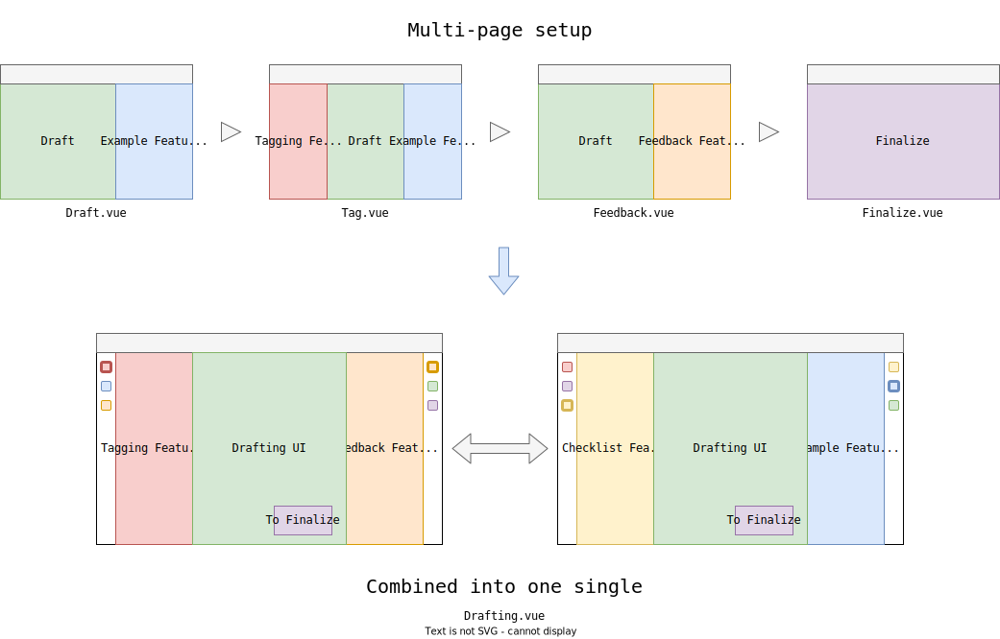

## Background

For the past few weeks, my major task has been refactoring the old step-wise drafting process of our app into a much more simplified one. Instead of dividing the drafting and submission process into several steps like _Drafting_, _Tagging_, _Feedback_ and _Finalize_, the goal is to have one unified interface where the features previously scattered across different steps can be integrated in one UI by a plug-in manner, similar to how VS Code plugins add new functionalities to the [Activity Bar and Side Bar](https://code.visualstudio.com/docs/getstarted/userinterface).



<!--  -->

The benefits are obvious: No duplicate event handlers implemented for shared components used across different pages; No need to care about updating data to the backend before navigating to other steps; The app feels more like an SPA and less like web pages; The new UI feels much more intuitive to new users, etc.

## The Migration

### Dynamic Component

Based on the requirements, it is pretty clear that we want to load the feature components in a dynamic fashion into the left and right panel. Vue provides support for this OOB via [dynamic components](https://vuejs.org/v2/guide/components.html#Dynamic-Components).

Using dynamic components is easy. You only need to bind the component definition or name to Vue's `<component>` using the `is` attribute:

```vue
<template>
  <component :is="currentRightComponent"></component>
</template>
```

Cool! Let's try to dynamically bind the `ExampleView` to a `<component>` in right panel. Wait a minute... What about the props and event bindings?

```vue
<template>
  <example-view
    :example="example"
    :visible="true"
    @next="showNextExample"
    @previous="showPreviousExample"
    @save="favoriteExample"
    @focus="hideTag"
  />
</template>
```

Lucky for us, all the Vue directives work in the dynamic `<component>` as well. So in a similar fashion, you can also pass props and bind event handlers to a dynamic component like so:

```vue
<template>
  <component
    v-if="currentRightComponent"
    :is="currentRightComponent"
    v-bind="currentRightComponentProps"
    v-on="currentRightComponentEvents"
  ></component>
</template>
```

Here `currentRightComponentProps` and `currentRightComponentEvents` are both local data properties. For a feature component `ExampleView`, these two values could look something like these:

```js
exampleViewComponentProps() {
  const localExample = this.example;
  return {
    example: localExample,
    visible: true,
  };
}
```

```js
exampleViewComponentEvents() {
  return {
      next: this.showNextExample,
      previous: this.showPreviousExample,
      save: this.favoriteExample,
      focus: this.hideTag,
  };
}
```

And with a click event handler on the corresponding item within the right sidenav that will trigger the dynamic loading, we have something like this (semi-pseudo code):

```vue
<template>
  <div class="draft-container">
    <div class="left-panel">
      <!-- Left Panel -->
    </div>
    <div class="editor-view">
      <!-- Editor View -->
    </div>
    <div class="right-panel">
      <drafting-side-bar class="sidebar">
        
      </drafting-side-bar>
      <keep-alive>
        <component
          v-if="currentRightComponent"
          :is="currentRightComponent"
          v-bind="currentRightComponentProps"
          v-on="currentRightComponentEvents"
        ></component>
      </keep-alive>
    </div>
  </div>
</template>

<script>
import ExampleView from "shared/components/example-view/ExampleView.vue";

export default {
  data(){
    return {
      currentRightComponent: null,
      example:null,
    }
  }
  computed: {
    exampleViewComponentProps() {
      const localExample = this.example;
      return {
        example: localExample,
        visible: true,
      };
    },
    exampleViewComponentEvents() {
      return {
        next: this.showNextExample,
        previous: this.showPreviousExample,
        save: this.favoriteExample,
        focus: this.hideTag,
      };
    },
  },
  methods: {
    loadRightComponent(componentName) {
      if (componentName === this.currentRightComponent?.name) {
        this.currentRightComponent = null;
      } else {
        switch (componentName) {
          case "ExampleView":
            this.currentRightComponent = ExampleView;
            this.currentRightComponentProps = this.exampleViewComponentProps;
            this.currentRightComponentEvents = this.exampleViewComponentEvents;
            break;
          default:
            break;
        }
      }
    },
    showNextExample(){/*...*/},
    showPreviousExample(){/*...*/},
    favoriteExample(){/*...*/},
    hideTag(){/*...*/},
  },
};
</script>
```

Nice! We have a functional dynamic component setup and `ExampleView` works as expected! :sparkles: However, as you might have noticed we have introduced a big problem here. :mag:

That's right! All these `ExampleView`'s implementation details (data, computed properties, event handlers, etc.) are actually living inside the `Drafting` component. Not only does it violate the single responsibility principle, but it will also hurt maintainability and extensibility down the road. As more "plugin" features are added to this interface, we can expect a 1000-line Vue component in the not-too-distant future. :scream: We definitely need a better structure to organize this, and that brings us to the meat of this blog post the Model-View-Presenter pattern.

### MVP (Model-View-Presenter) Pattern

What is MVP pattern? In short, it's a pattern derived from MVC and serve as a structure to better maintain separation of concern. There are a few layers:

- `Model` - Where the data sources lives
- `View` - Where the UI rendering happens
- `Presenter` - Where the complex domain/UI logic lives

In the case of Vue (or any frontend framework), **View** takes care of rendering HTML elements and event handling, **presenter** takes care of data transformation according to domain or UI logic, and **model** takes care of providing and persisting data via various I/O options. Therefore, we can roughly map it to the following concepts in Vue:

- `Model` :arrow_right: Smart (Container) Components w/ Vuex + Axios
- `View` :arrow_right: Dumb (Presentational) Components
- `Presenter` :arrow_right: Composables

There are some key points that worth emphasizing:

- Only container components have access to Vuex store and various services to make API calls.
- Presentational components have no idea of what other parts of the app are doing. They receive data by `props` and emit events. The **only** logic they have access to are presenters.
- Presenters in this context are no just some random Vue composables. There should be no direct access to the store via something like `useStore`. They should not be making API calls either. In other words, they should be "dumb" as well.

If the guidelines above are violated, you are likely to end up with some components that violate Single Responsibility Principle (SRP) and hence, are less testable and maintainable.

### Applying MVP to `Drafting.vue`

It might be easier to understand the benefits by seeing MVP in action. Following the above guideline, we can now refactor our `Drafting` component as such:

```vue {linenos=inline,hl_lines=[36,19]}
<template>
  <div class="draft-container">
    <div class="left-panel">
      <!-- Left Panel -->
    </div>
    <div class="editor-view">
      <!-- Editor View -->
    </div>
    <div class="right-panel">
      <drafting-side-bar class="sidebar">
        
      </drafting-side-bar>
      <keep-alive>
        <!-- No more props and event binding on the dynamic component-->
        <component
          v-if="currentRightComponent"
          :is="currentRightComponent"
        ></component>
      </keep-alive>
    </div>
  </div>
</template>

<script>
export default {
  data(){
    return {
      currentRightComponent: null,
    }
  }
  // No more example-related data, computed properties and methods
  methods: {
    loadRightComponent(componentName) {
      if (componentName === this.currentRightComponent?.name) {
        this.currentRightComponent = null;
      } else {
        switch (componentName) {
          case "ExampleView":
            this.currentRightComponent = ExampleView;
            break;
          default:
            break;
        }
      }
    },
  },
};
</script>
```

By taking a look at the larger picture, we can visualize the overall architecture in this diagram:



Essentially, we are turning the top-level `Drafting` component into a container component for three container components. It hosts or dynamically loads other container components (e.g. `ExampleView`) but does not concern itself with their implementation details.


You might have noticed the `XXXView` pattern here. Yes, that's the naming convention chosen to indicate container components. I picked it for our project but you can choose your own.


The container components, like `ExampleView`, can connect to Vuex store, make API calls, provide data and event handlers for the child presentational components. In simple cases, the presentational components render to HTML and that's it. However, sometimes there can be complex business or UI logic and again, you should want extract it and separate it from the Vue framework whenever possible. There's more than one way to skin a cat but the simplest solution nowadays would be a Vue composable via Composition API. You can also extract it into a library/module that you can extend and improve in the future.

An example of such presenter is the `QuillEditor` class from an internal `editor` library that empowers the `QuillEditor` Vue component, which in turn empowers the `EmailEditor` component. Inside this `QuillEditor` component, there is an line for editor initialization:

```js
this.editor = new QuillEditor(initConfig);
```

where the definition of class `QuillEditor` looks something like this:

```ts
export class QuillEditor
  extends TypedEmitter<QuillEditorEvents>
  implements CoreEditor, TaggableExtension, HighlightableExtension {
  /* implementation */
}
```

As you can see, we extended the default rich text editor with tagging and colored highlighting feature, and such domain logic and UI behavior are nicely encapsulated inside this `QuillEditor` class.

So what are the benefits? There are, IMHO, quite a few:

- Better code organization and separation of concern. You know the role of each component so when you need to add a new feature, you know exactly what type of logic should go where. The same also applies to debugging.
- Looser coupling. Take the mentioned `QuillEditor` library for example: It's loosely coupled with the main app. If we want to add new functionalities or even swap the underlying implementation (e.g. Quill :arrow_right: TipTap) in the future, we can simple refactor this `presenter` without worrying breaking other parts of the app as long as it implements those interfaces correctly.
- Better testability. E2E/Integration testing can be brittle and hard to set up (I am **not** saying you should never perform them but it can be tricky!). By having a clear separation between container and presentational components, it would be much easier to test a subset of "dumb" components. Even better, by extracting the critical UI and business logic into composables and libraries, you can test the critical part more efficiently without involving a large UI framework that's Vue.
- Better maintainability. It is now easier to reason about your code, easier to test and get critical logic right, easier to locate certain code and easier to refactor old features and add new ones. Maintainability :up:

## Conclusion

There you have it! An example of how to refactor a complex component and apply MVP along the way to make our code better. In case you want to learn more about this pattern, there are a few articles that might interest you (despite being Angular-focused, the ideas introduced should be framework-agnostic):

- [MVP with Angular](https://dev.to/this-is-angular/model-view-presenter-with-angular-533h)
- [BLoC Design with Angular](https://medium.com/lacolaco-blog/bloc-design-pattern-with-angular-1c2f0339f6a3)

Hope this post has been helpful and see you in the next one!
